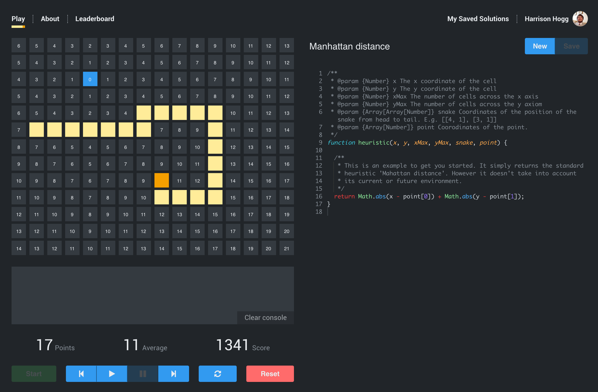
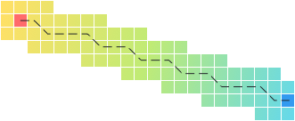

<p align="center">
  
</p>



#### Pathfinding and Heuristics

Pathfinding is ["the problem of finding a good path from the starting point to the goal―avoiding obstacles, avoiding enemies, and minimizing costs (fuel, time, distance, equipment, money, etc)" (Amit Patel)](http://theory.stanford.edu/~amitp/GameProgramming/). A heurisitic funcition provides an estimated value of the cost for a step to the goal. It can be used to control the behaviour of the searching algorithm.

<p align="center">
  
</p>

#### Playing Snake Heuristics

The goal is to move the snake across the cells to the point by returning a number from the heuristic() function. The function is called for every cell every time the snake needs to move, and is provided with information of the environment.

The lowest number given for the 3 cells around the snakes head will be the next position the snake will take. If two cells have the same value, the first cell clockwise from the top cell will be selected. Cells that are out of bounds and contain the snake are already excluded from selection.

#### Scoring

To encourage minimizing costs, metrics for each point collection and the overall averages are fed into a rudementary scoring system. This will give an indication to how good your solution is.

#### The Leaderboard

Solutions are temporary stored into local storage, but when authenticated with GitHub they can be stored more perminantly. Once a valid solution has been saved, it can be submitted to the Leaderboard where it will be run against a similar environment.

## Try it out locally
```
git clone git@github.com:HHogg/snake-heuristics.git
cd snake-heuristics
yarn install
yarn start
```
