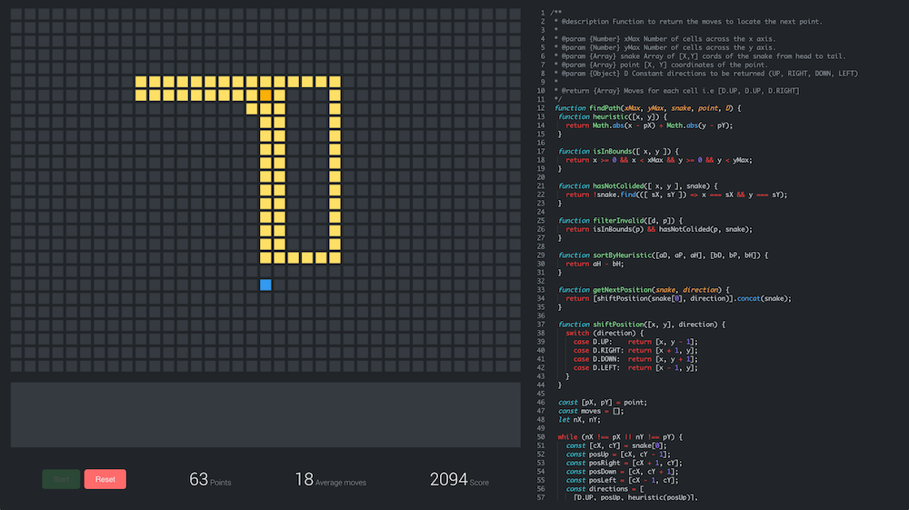

# Snake Heuristics

#### Try it out here [https://hhogg.github.io/snake-heuristics](https://hhogg.github.io/snake-heuristics)

Snake Heuristics is a game of ["Pathfinding"](http://theory.stanford.edu/~amitp/GameProgramming/Heuristics.html), by writing a simple heuristic function. 

Pathfinding, as Amit Patel succinctly puts,

> ... addresses the problem of finding a good path from the starting point to the goal―avoiding obstacles, avoiding enemies, and minimizing costs (fuel, time, distance, equipment, money, etc.). 



#### About the game

* The code is fun in a sandbox worker... I haven't tested how secure this is. You might be able to cheat ¯\_(ツ)_/¯
* The code is stored in locale storage, so don't worry if you refresh. 
* The scoring system is rudimentary to say the least, don't take it too seriously... but 
  * The less moves you take the higher your score will be.
  * The lower your average score over the whole game the higher your score will be.
  * The higher level you get to the quicker your score increases.
* It turns out it's pretty hard!

#### ... but why?

A combination of events led to this. 

1. I realised all I ever build is enterprise applications.
1. I was reading about [[AI](http://waitbutwhy.com/2015/01/artificial-intelligence-revolution-1.html)/[Tesla/Elon](http://waitbutwhy.com/2015/05/elon-musk-the-worlds-raddest-man.html) on Wait But Why](). (I highly recommend!)
1. A fellow developer asked me if I had ever built anything just for fun, and I shamefully had to admit I was boring.

Initially it didn't start like a game... just wanted to write an algorithm for the perfect snake game, but I got fed up of switching back and forth from my editor and the browser so I stuck and editor into the browser.... then a scoring system.

### Try it out locally
```
git clone git@github.com:HHogg/snake-heuristics.git
cd snake-heuristics
yarn install
yarn start
```
